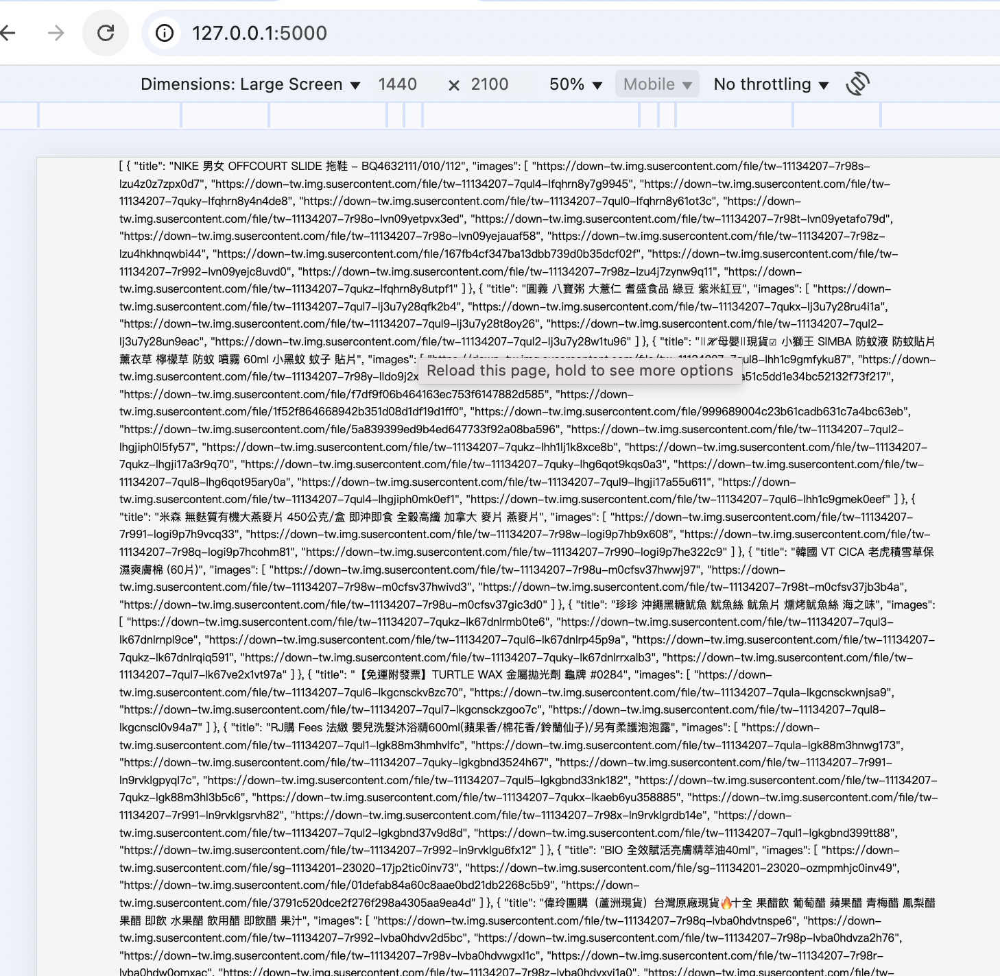
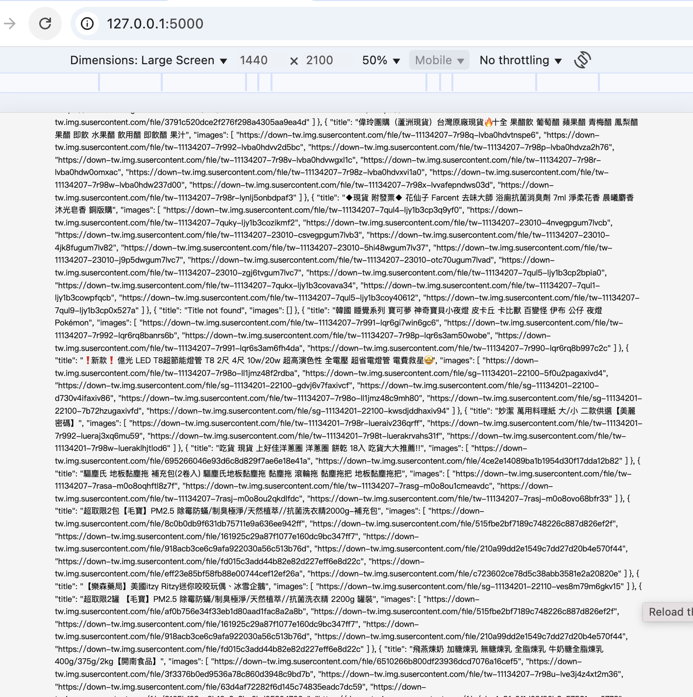
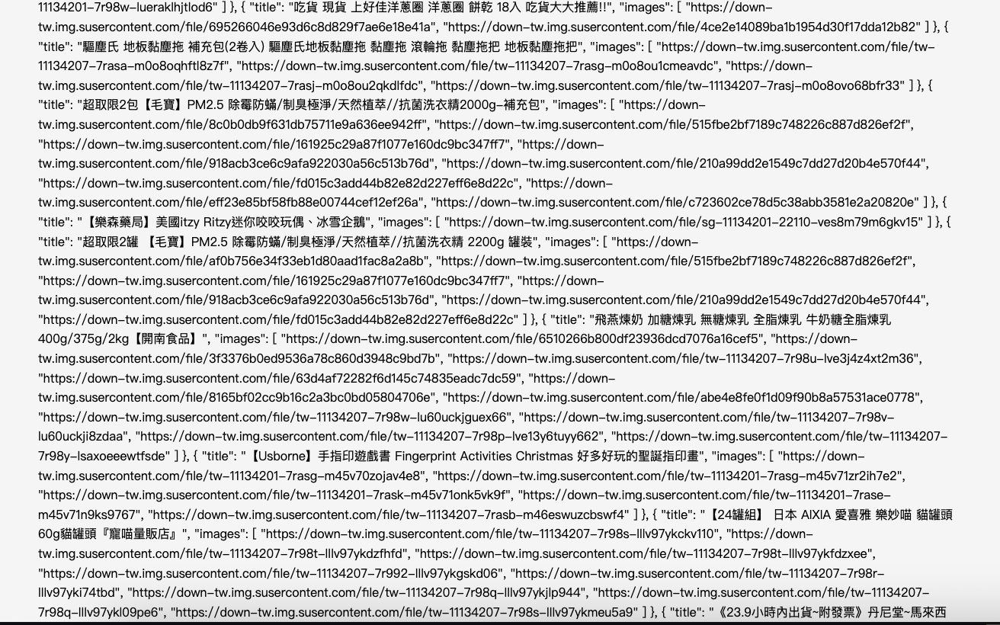

# python_scrapping_shopee

Scrapping shopee taiwan

# How to run

1. pip3 install -r requirements.txt
2. python3 main.py
3. Call API http://127.0.0.1:5000/scrape

Here are some screenshots of the application:

1. **Homepage**
   
   
   
